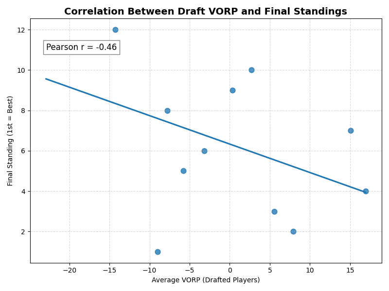
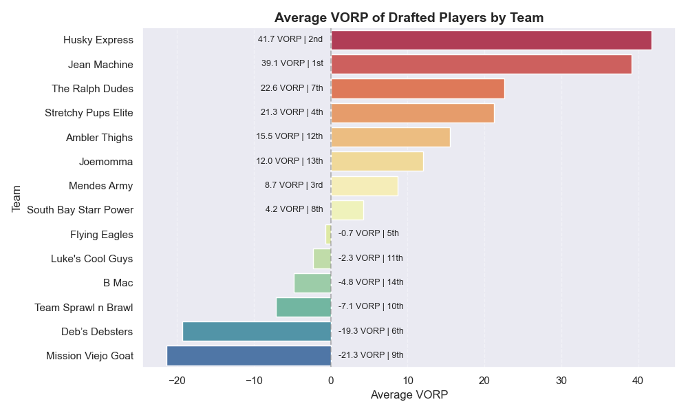
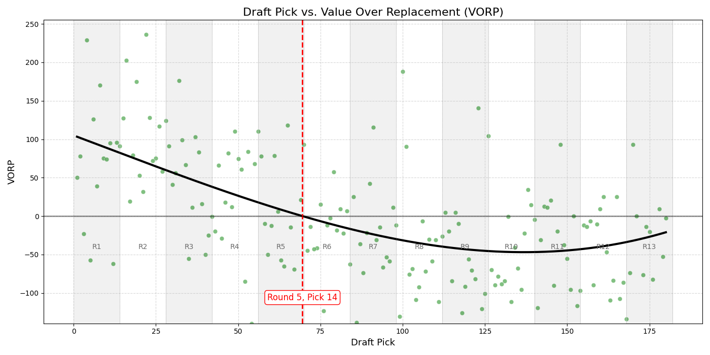
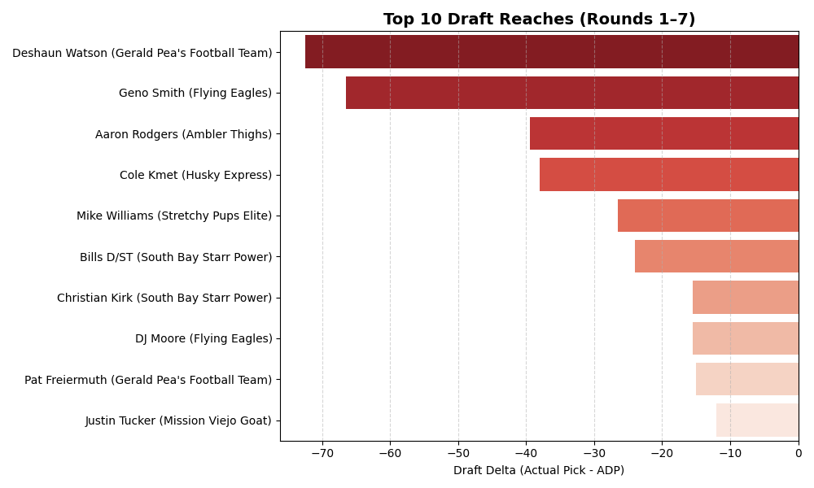
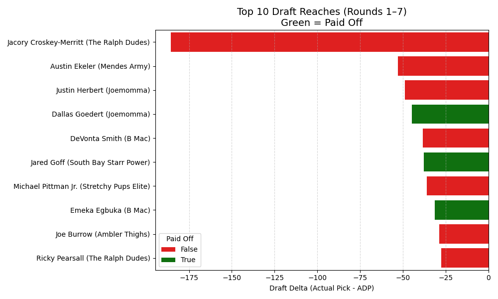
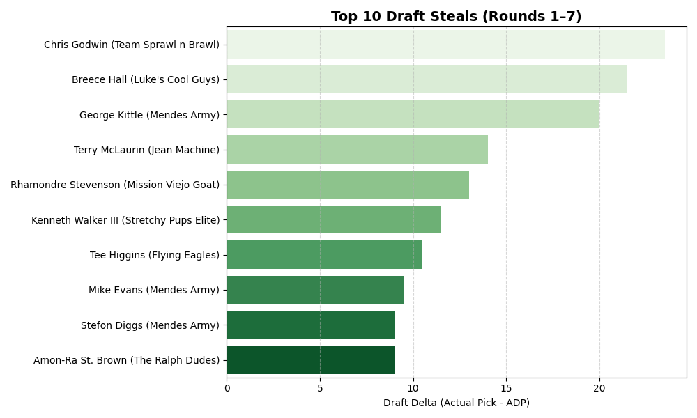
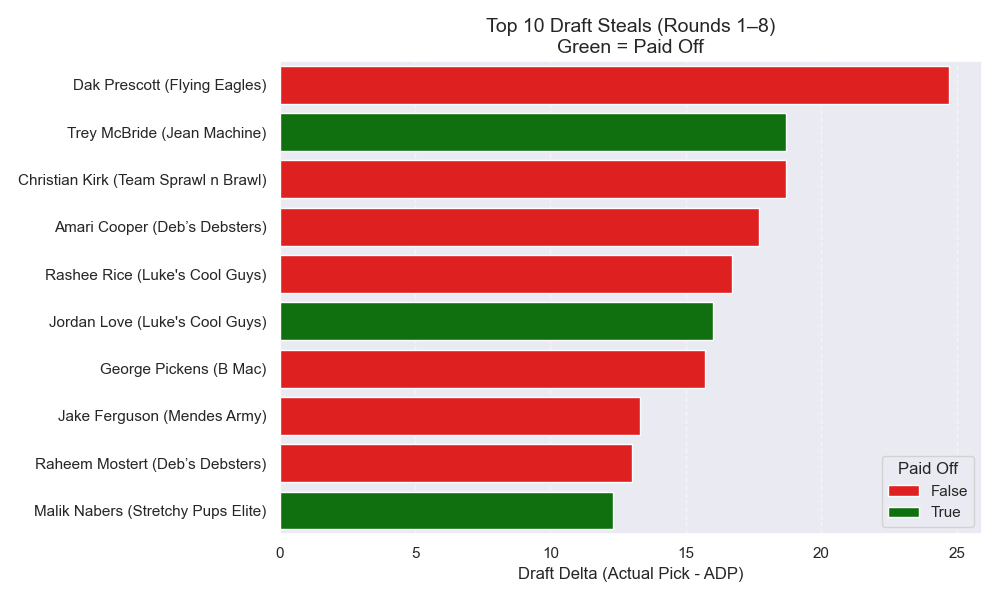
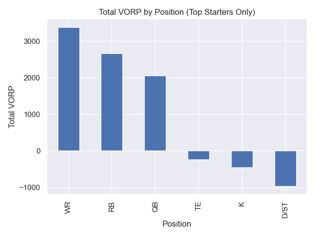

# 🏈 How Important is Drafting?

I wanted to find out how much the draft impacts fantasy football success — and which players **delivered the most value** in last season’s draft. Using data from ESPN’s Fantasy API and draft results from my league, I analyzed who truly lived up to their draft slot – and who didn’t.

---

## 📊 How I Got the Data

To conduct this analysis, I pulled:
- The full draft order
- Fantasy points scored
- Positional ranks

From there, I calculated a custom **Value Over Replacement Player (VORP)** metric based on my league format:

- 14 teams
- 2 RB, 2 WR, 1 TE, 1 Flex (WR/RB/TE), 1 QB, 1 Kicker, 1 D/ST

> **VORP = Player Points − Avg. Starter at Position**

---

## 📈 Correlation Between VORP and Final Standings

The first step was to measure whether average draft VORP correlates with league success. As shown in the chart below, there's a **strong negative correlation** (r = –0.51), meaning that the **higher your team’s average VORP, the better you tend to finish**.

<!--
<figure>
  
  <figcaption style="text-align:center">Figure: Strong negative correlation (r = -0.51)</figcaption>
</figure>
-->

---

## 📊 Average VORP by Team

To further illustrate the relationship, I plotted the average VORP per team. Teams with higher average VORP clearly finished higher in the standings.

---

## 🎯 Draft Pick vs. VORP

I also examined how value changed by draft pick. The chart shows that **early-round selections offer higher VORP**, but some late-round picks still returned huge value.

---

## 🔎 Reaches (Original)

This chart highlights picks that were selected far earlier than their final production justified. Many of these were **inefficient picks** that underperformed expectations.

---

## 🔎 Reaches (Paid Off)

Some "reaches" paid off in a big way. This chart shows picks that were drafted earlier than consensus but **exceeded expectations**.

---

## 💰 Steals (Original)

These players were **drafted late** but delivered starter-level performance. Steals like this can win you your league.

---

## 💰 Steals (Paid Off)

These were picks that **significantly outperformed their draft position**. Some of the best values in the draft.

---

## 📌 VORP by Position

This visualization breaks down where the **most draft value** came by position. Certain positions, like WR and RB, tend to offer the most differential impact compared to replacement-level players.

---

## 🧾 Conclusion

This analysis shows that the **draft is absolutely critical** to fantasy football success — especially in the first **7 rounds**, where the majority of value is concentrated.

### 🔑 Key Takeaways:
- **Drafting well matters**: higher team VORP correlates with better final standings.
- **Reaches can backfire**, but some bold picks pay off.
- **Steals in late rounds** can be league-winners.
- **Use VORP** to normalize cross-position value and build smarter draft boards.

Whether you're a casual player or a competitive fantasy manager, integrating this kind of analysis into your draft strategy gives you a serious edge.

---